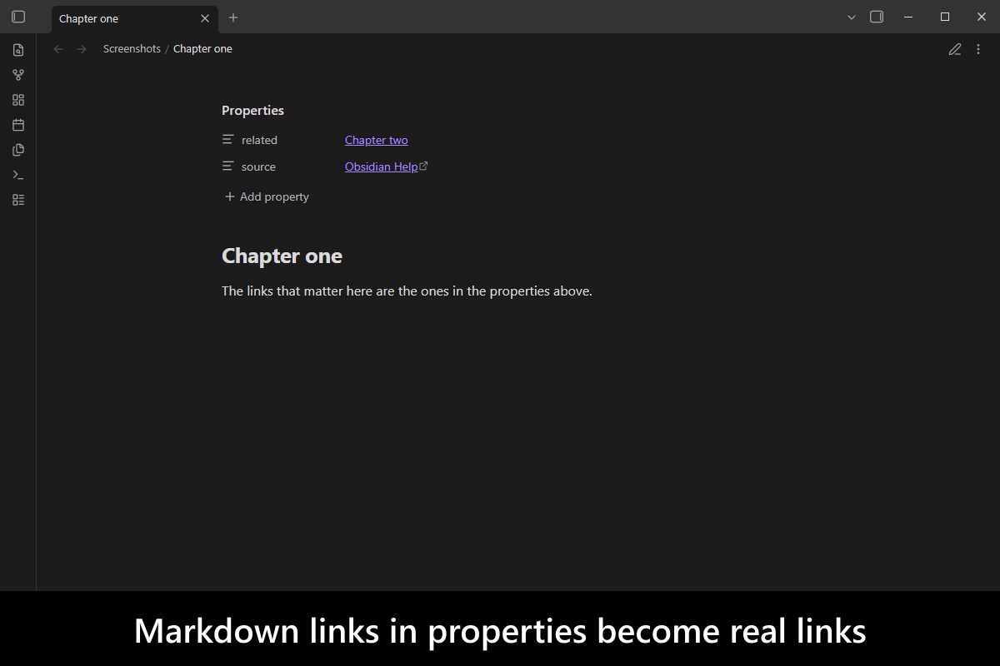
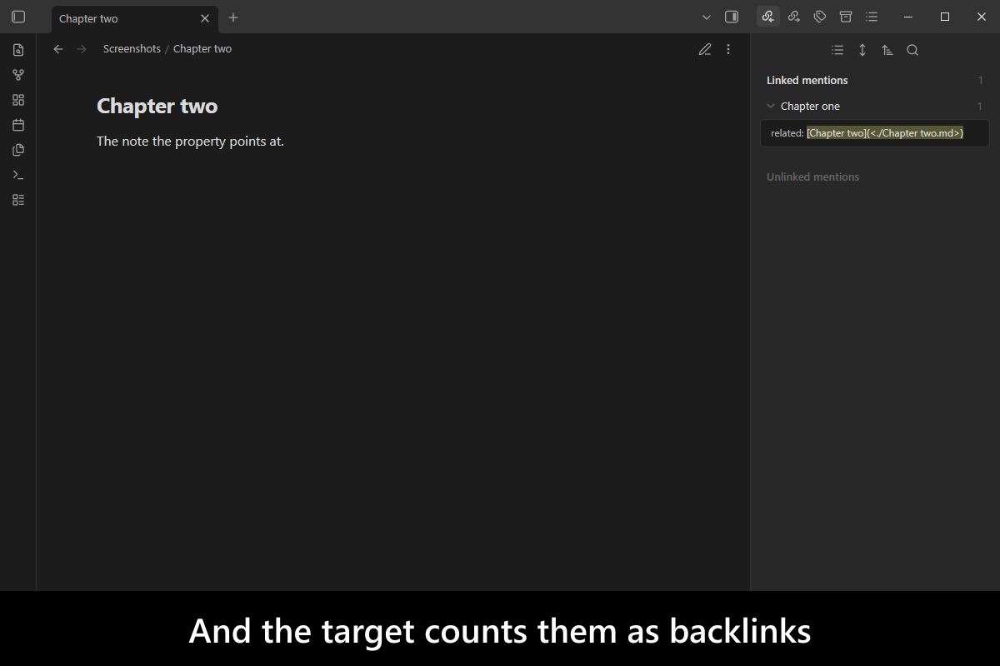
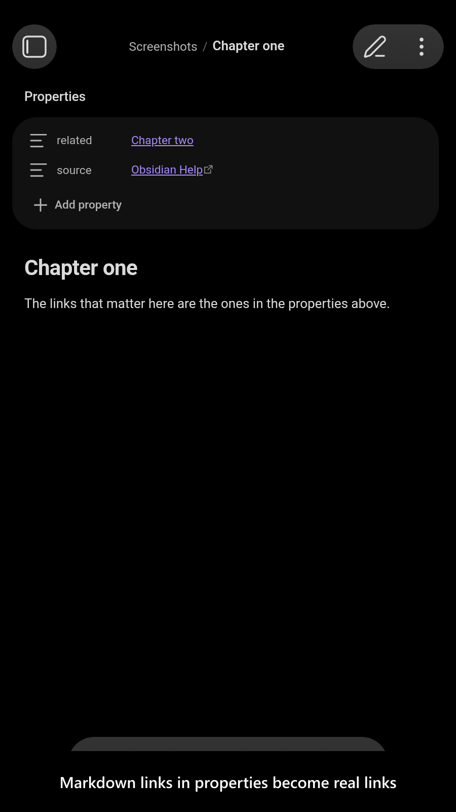
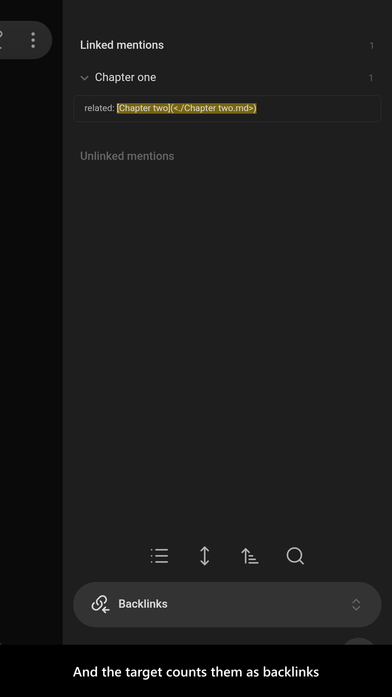

# Frontmatter Markdown Links

[](https://www.buymeacoffee.com/mnaoumov) [](https://github.com/mnaoumov/obsidian-frontmatter-markdown-links/releases) [](https://github.com/mnaoumov/obsidian-frontmatter-markdown-links/releases) [](https://github.com/mnaoumov/obsidian-frontmatter-markdown-links)

[Obsidian](https://obsidian.md/) makes `[[wikilinks]]` in frontmatter clickable, but a markdown link written in a property is just text: it does not resolve, it does not open, and it does not register as a backlink. So a vault that uses markdown links everywhere else has to switch styles the moment a link moves into a property.

This plugin makes markdown links in frontmatter real links — clickable in Source mode, Live Preview and Reading, resolvable, and counted as backlinks on their targets.

Long-requested on the Obsidian forum, for both [internal](https://forum.obsidian.md/t/properties-support-external-markdown-links/76918) and [external](https://forum.obsidian.md/t/properties-support-internal-markdown-links/63825/) links.

<!-- markdownlint-disable MD033 -->

<a href="https://github.com/mnaoumov/obsidian-frontmatter-markdown-links/blob/HEAD/images/screenshots/screenshot-desktop-1.png"></a>

<details>
<summary>More screenshots</summary>

<div>
<a href="https://github.com/mnaoumov/obsidian-frontmatter-markdown-links/blob/HEAD/images/screenshots/screenshot-desktop-2.png"></a>
<a href="https://github.com/mnaoumov/obsidian-frontmatter-markdown-links/blob/HEAD/images/screenshots/screenshot-mobile-1.png"></a>
<a href="https://github.com/mnaoumov/obsidian-frontmatter-markdown-links/blob/HEAD/images/screenshots/screenshot-mobile-2.png"></a>
</div>

</details>

<!-- markdownlint-enable MD033 -->

## Demo vault

**The documentation is a demo vault.** Every feature has a note that explains what it does and why you would want it — and whose own properties are the demonstration.

**[Start reading here](<./demo-vault/00 Start.md>)** — it is plain markdown, so it works on GitHub with nothing installed.

A copy of the vault ships with every release. You can access it via any of the following:

1. Running the **Frontmatter Markdown Links: Open demo vault** command.
2. Downloading `frontmatter-markdown-links-demo-vault-<version>.zip` (`<version>` is the release version) from the [Releases](https://github.com/mnaoumov/obsidian-frontmatter-markdown-links/releases).
3. Browsing its source in [`demo-vault/`](./demo-vault/README.md) in this repository.

## What it does

- **Markdown links in properties become real links** — clickable in every mode, with paths that contain spaces working either percent-encoded or in angle brackets, and embeds supported too. Several links can live in one property. [01 Frontmatter markdown links](<./demo-vault/01 Frontmatter markdown links.md>)
- **They count as backlinks**, so a note linked only from a property still shows up on its target. [02 Backlinks](<./demo-vault/02 Backlinks.md>)
- **Settings**, including how much of this you want. [03 Settings](<./demo-vault/03 Settings.md>)

## Installation

The plugin is available in [the official Community Plugins repository](https://community.obsidian.md/plugins/frontmatter-markdown-links).

### Beta versions

To install the latest beta release of this plugin (regardless if it is available in [the official Community Plugins repository](https://community.obsidian.md) or not), follow these steps:

1. Ensure you have the [BRAT plugin](https://community.obsidian.md/plugins/obsidian42-brat) installed and enabled.
2. Click [Install via BRAT](https://intradeus.github.io/http-protocol-redirector?r=obsidian://brat?plugin=https://github.com/mnaoumov/obsidian-frontmatter-markdown-links).
3. An Obsidian pop-up window should appear. In the window, click the `Add plugin` button once and wait a few seconds for the plugin to install.

## Debugging

By default, debug messages for this plugin are hidden.

To show them, run the following command:

```js
window.DEBUG.enable('frontmatter-markdown-links');
```

For more details, refer to the [documentation](https://mnaoumov.dev/obsidian-dev-utils/guides/debugging/).

## Changelog

All notable changes to this project will be documented in the [CHANGELOG](./CHANGELOG.md).

## Contributing

Contributions are welcome — see [CONTRIBUTING](./CONTRIBUTING.md) to get set up.

## Support

<!-- markdownlint-disable MD033 -->

<a href="https://www.buymeacoffee.com/mnaoumov" target="_blank"></a>

<!-- markdownlint-enable MD033 -->

## My other Obsidian resources

[See my other Obsidian resources](https://github.com/mnaoumov/obsidian-resources).

## License

© [Michael Naumov](https://github.com/mnaoumov/)
